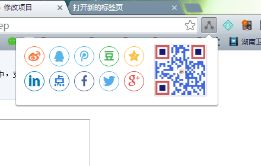
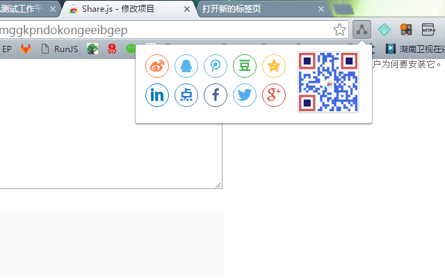

# Share.js

一个chrome插件，用于一键分享网页的，非常简单清新，无广告，无依赖

## 安装

 - Chrome市场：[Share.js](https://chrome.google.com/webstore/detail/sharejs/hknmadpbjapcmmggkpndokongeeibgep)
 - 下载本项目代码自行安装

## 截图

## 说明

使用以下下开源项目：

 - [overtrue/share.js](https://github.com/overtrue/share.js)
 - [gera2ld/jsqrgen](https://github.com/gera2ld/jsqrgen)